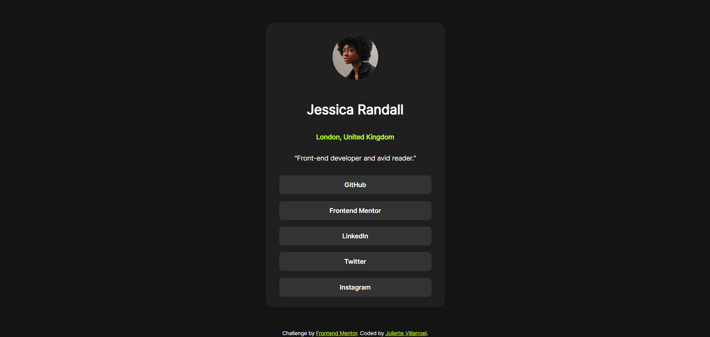

# Frontend Mentor - Social links profile solution

This is a solution to the [Social links profile challenge on Frontend Mentor](https://www.frontendmentor.io/challenges/social-links-profile-UG32l9m6dQ). Frontend Mentor challenges help you improve your coding skills by building realistic projects. 

## Table of contents

- [Overview](#overview)
  - [The challenge](#the-challenge)
  - [Screenshot](#screenshot)
  - [Links](#links)
- [My process](#my-process)
  - [Built with](#built-with)
  - [What I learned](#what-i-learned)
  - [Useful resources](#useful-resources)
- [Author](#author)
- [Acknowledgments](#acknowledgments)

**Note: Delete this note and update the table of contents based on what sections you keep.**

## Overview

### The challenge

Users should be able to:

- See hover and focus states for all interactive elements on the page

### Screenshot



### Links

- Solution URL: [GitHub Page](https://github.com/juliettedb-v/social-links-profile-main-challenge)
- Live Site URL: [Add live site URL here](https://your-live-site-url.com)

## My process

I started by creating my HTML the best way possible, then I focused on the distribution by checking on the images and different screenshots, I fully recommend using variable with :root to make this part easier and after a couple of minutes I could finish the design its active status. It was fun to do it!

### Built with

- Semantic HTML5 markup
- CSS custom properties
- Flexbox


### What I learned

This challenge was way easier than my first one, but I learned to use relative units of measurement like rem to improve and manage my responsive design. It was really useful for this challenge.

I'm really proud of this section:

```css
    .social-links button {
      display: flex;
      flex-direction: column;
      justify-content: center;
      align-items: center;
      background-color: var(--Grey-700);
      border: none;
      margin: 0.87rem;
      width: 20rem;
      height: 2.5rem;
      border-radius: 0.5rem;
    }

    .social-links button a {
      color: var(--White);
      text-decoration: none;
      font-family: var(--heading);
    }

    .social-links button:hover {
      background-color: var(--Green);
      cursor: pointer;
    }
  
    .social-links button:hover > a {
      color: var(--Grey-900);
    }
```

### Useful resources

- [Px to rem conversor](https://nekocalc.com/es/px-a-rem-conversor) - This helped me to converse all my px values to rem, it was faster.

## Author

- Website - [Juliette](https://github.com/juliettedb-v)
- Frontend Mentor - [@juliettedb-v](https://www.frontendmentor.io/profile/juliettedb-v)

## Acknowledgments

Taking Platzi's courses really helped me out to understand basic knowledge that I needed for completing this challenge. I know it's helpful for a lot of hispanics out there and I highly recommend it.
